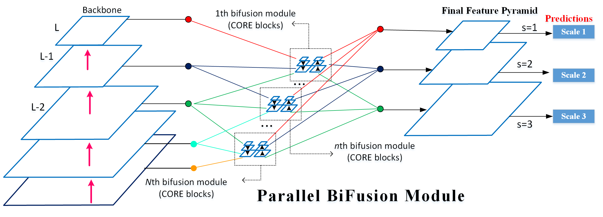

# PRBNet PyTorch
This is the reference PyTorch implementation for training and testing  [single-shot object detection](https://github.com/pingyang1117/PRBNet_PyTorch/tree/main/prb) and [oriented bounding boxes](https://github.com/pingyang1117/PRBNet_PyTorch/tree/main/obb) models using the method described in

> **[Parallel Residual Bi-Fusion Feature Pyramid Network for Accurate Single-Shot Object Detection](https://ieeexplore.ieee.org/abstract/document/9603994)**
>
> [Ping-Yang, Chen](https://scholar.google.com.tw/citations?user=cGHFHm0AAAAJ&hl=zh-TW), [Ming-Ching Chang](https://www.albany.edu/computer-science/faculty/ming-ching-chang), [Jun-Wei Hsieh](https://aicvlab2019.wordpress.com/), and [Yong-Sheng Chen](https://www.cs.nycu.edu.tw/members/detail/yschen)
>
> [TIP 2021 (arXiv pdf)](https://arxiv.org/abs/2012.01724)

<div align="center">
    <a href="./">
        
    </a>
</div>

## Performance 

### MS COCO
#### P5 Model

| Model | Test Size | AP<sup>test</sup> | AP<sub>50</sub><sup>test</sup> | AP<sub>75</sub><sup>test</sup> | AP<sub>s</sub><sup>test</sup> |
| :-- | :-: | :-: | :-: | :-: | :-: | 
| **YOLOX-x** | 640 | **51.5%** | **-** | **-** | **-** |
| **YOLOv7** | 640 | **51.4%** | **69.7%** | **55.9%** | **31.8%** | 
|  |  |  |  |  |  |  |  
| [**PRB-FPN-CSP**](https://drive.google.com/file/d/1vUglmai8lqfiEL2_nJZBZju-tGlrFL0I/view?usp=sharing) | 640 | **51.8%** | **70.0%** | **56.7%** | **32.6%** | 
| [**PRB-FPN**](https://drive.google.com/file/d/1XQ2hSXq3fAWoH1qBynrMZwYSzPGe78nT/view?usp=sharing) | 640 | **52.5%** | **70.4%** | **57.2%** | **33.4%** |
|  |  |  |  |  |  |  | 

#### P6 Model
| Model | Test Size | AP<sup>test</sup> | AP<sub>50</sub><sup>test</sup> | AP<sub>75</sub><sup>test</sup>  | Params (M) |
| :-- | :-: | :-: | :-: | :-:  |  :-: | 
| **YOLOv7-D6** | 1280 | **56.6%** | **74.0%** | **61.8%**  | **154.7M** |
| **YOLOv7-E6E** | 1280 | **56.8%** | **74.4%** | **62.1%** | **151.7M**| 
|  |  |  |  |  |  |  |  
| [**PRB-FPN6-2PY**](https://drive.google.com/file/d/1kxmVqGe-j9rVSUbg-122Q7hwwbeQACGM/view?usp=sharing) | 1280 | **55.9%** | **73.7%** | **61.1%**  | **137.5M**| 
| [**PRB-FPN6-3PY**](https://drive.google.com/file/d/1vcMgBM6KseSZKHjUuRhpLiVA4TswDzYu/view?usp=sharing) | 1280 | **56.7%** | **74.2%** | **61.9%** | **184.5M**| 
|  |  |  |  |  |  |  |    

If you find our work useful in your research please consider citing our paper:

```
@ARTICLE{9603994,
  author={Chen, Ping-Yang and Chang, Ming-Ching and Hsieh, Jun-Wei and Chen, Yong-Sheng},
  journal={IEEE Transactions on Image Processing}, 
  title={Parallel Residual Bi-Fusion Feature Pyramid Network for Accurate Single-Shot Object Detection}, 
  year={2021},
  volume={30},
  number={},
  pages={9099-9111},
  doi={10.1109/TIP.2021.3118953}}
```

If you find the backbone also well-done in your research, please consider citing the CSPNet. Most of the credit goes to Dr. Wang:

```
@inproceedings{wang2020cspnet,
  title={{CSPNet}: A New Backbone That Can Enhance Learning Capability of {CNN}},
  author={Wang, Chien-Yao and Mark Liao, Hong-Yuan and Wu, Yueh-Hua and Chen, Ping-Yang and Hsieh, Jun-Wei and Yeh, I-Hau},
  booktitle={Proceedings of the IEEE/CVF Conference on Computer Vision and Pattern Recognition Workshops},
  pages={390--391},
  year={2020}
}
```


# Acknowledgement
Without the guidance of Dr. Mark Liao and a discussion with Dr. Wang, PRBNet would not have been published quickly in TIP and open-sourced to the community. Many of the code is borrowed from [YOLOv4](https://github.com/WongKinYiu/PyTorch_YOLOv4), [YOLOv5_obb](https://github.com/hukaixuan19970627/yolov5_obb), and [YOLOv7](https://github.com/WongKinYiu/yolov7). Many thanks for their fantastic work:

* https://github.com/AlexeyAB/darknet
* https://github.com/ultralytics/yolov3
* https://github.com/WongKinYiu/PyTorch_YOLOv4
* https://github.com/ultralytics/yolov5
* https://github.com/hukaixuan19970627/yolov5_obb
* https://github.com/WongKinYiu/yolov7